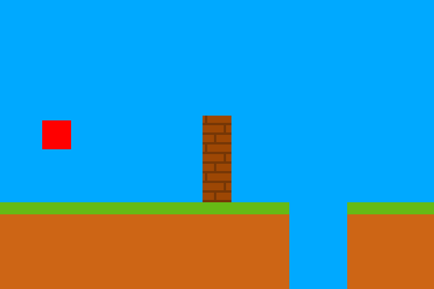

# Super Mario Bros

A Super Mario Bros clone I'm creating for learning C++.

While the game is nowhere near playable yet, I decided to start comitting and putting it on GitHub anyway for reference, and the ability for me to go see what the game used to look like in its very beginning.
